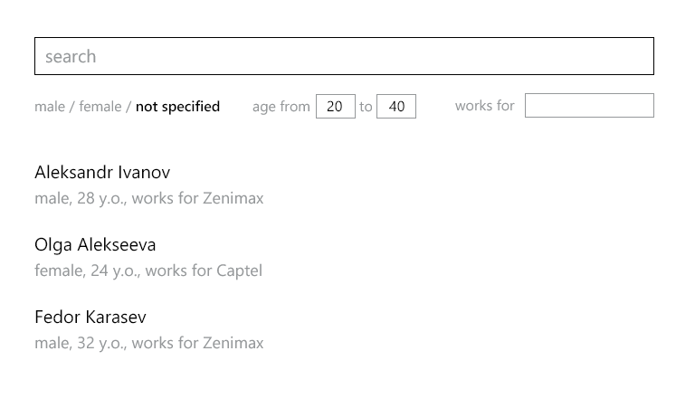

# Friends explorer pre-employment test

## Task
Your goal is to write friend search/navigation for hypothetical social network.
You should implement SPA containing two pages (main page and person page)
that gives an end user ability to search and navigate people.

Below there is a sketch given to describe UX (you don't need to strictly follow the design).

 

### Main page
Main page consists of search input and a filter set (sex, age, company).
Below there are search results that display people that match given search and filter set.
Page address is `/`.

Clicking on a person in search results navigates to person page.

### Person page
Person page is a duplicate of main page with few exceptions:
- there is person info above search input
- there is close button next to person info which leads to main page
- search works only for a friend of displayed person
- page address is `/person/<id>`

### Search/filtering requirements
- Changing filter leads to a change of search results
- Search results should dynamically respond to search input and don't require user to press 'enter' to change results

### Navigation requirements
- Browser navigation should work (forward/back arrows)
- Navigating to a person page or main page should reset search input and filter values  
- When navigated forward or backward, filter and search input values should restore values set by user when he was on a particular page

### User data
- There is `friends.json` file within this repository containing user information.
- Your SPA should load this data and put it in an appropriate storage.
- No backend needed, just include this data in SPA.

## Technological requirements
- **JavaScript** (any version you can transpile and polyfill to ES5)
- **TypeScript** instead of JavaScript would be a plus
- You should use **React** to render UI
- You should build SPA using **webpack**
- for state management you can use any solution of your choice (**redux** or **mobx** is a plus)
- It's prohibited to use **AngularJs** and/or **JQuery**
- For routing you can use any router of your choice (but using **History API** directly would be a plus)

## Sharing result
- result should be provided as github repository
- run instructions should be described in README.md
- simple dev server is completely ok (you can use docker if you want)
